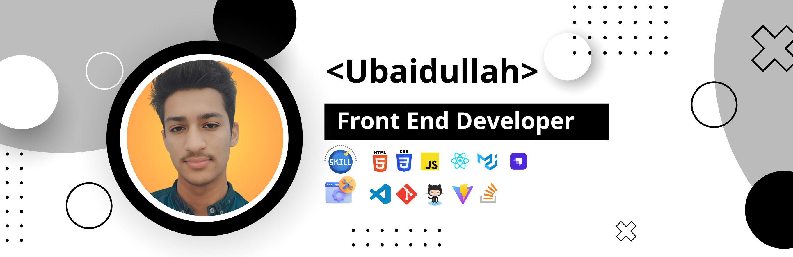

### Hi there 👋, My name is Ubaidullah
#### React JS Developer & also UIUX Designer

Let's connect!

 

My name is Ubaidullah. Working on React JS👨‍💻 Tech lover 🤖, Web Developer💻   and Robotic enthusiast🤖. Exploring new technologies in Web Development   Like Next JS.🌐

Skills: HTML / CSS / JavaScript / React JS / Material UI / Strapi Headless CMS

- 🔭 I’m currently working as a Freelancer. 
- 🌱 I’m currently learning Next JS. 
- 📫 How to reach me: Ubaidullahu449@gmail.com 
- 💻 Developing beautiful Website in React JS with ❤
- 😎 FUN FACT: I am Unstopable.

## Languages & Tools

<code></code>
<code></code>
<code></code>
<code></code>
<code></code>
<code></code>

[twitter]: https://www.twitter.com/rmahmadkhan/
[linkedin]: https://www.linkedin.com/in/rmahmadkhan/
[instagram]: https://www.instagram.com/rmahmadkhan/
[facebook]: https://www.facebook.com/rmahmadkhan
